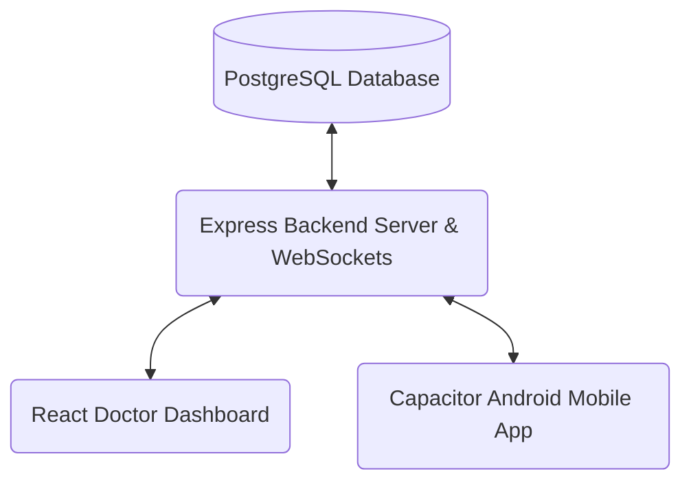

# RuralCareLink Telemedicine System — Deployment Guide

This guide provides step-by-step instructions to deploy the entire RuralCareLink Telemedicine system from your local machine to production.

The system consists of four main parts:
1. **Database**: PostgreSQL (production database)
2. **Backend Server**: Node.js Express server + WebSockets (Socket.IO) + Prisma
3. **Doctor Dashboard**: React frontend (Web app for doctors)
4. **Mobile App**: React frontend + Capacitor (Android app for health workers)

---

## Architecture Overview



---

## Step 1: Deploy the PostgreSQL Database

Since the local SQLite/PostgreSQL database is not accessible over the internet, you need a cloud-hosted database.

### Options:
* **Neon** (Recommended - has a generous free tier)
* **Railway**
* **Supabase**

### Setup:
1. Sign up on [Neon.tech](https://neon.tech/) and create a new project.
2. Select **PostgreSQL 16** (or newer).
3. Copy your database connection string, which will look like:
   `postgresql://[user]:[password]@[host]/[dbname]?sslmode=require`
4. Keep this connection string safe. This will be your `DATABASE_URL` environment variable.

---

## Step 2: Deploy the Backend Server

The backend server runs the Node.js Express app and coordinates WebSockets for the video consultation signaling.

### Options:
* **Railway** (Recommended - supports WebSockets out of the box with zero configuration)
* **Render** (Free tier spinner restarts, WebSockets require extra setup)
* **DigitalOcean VPS / AWS EC2** (For maximum reliability and custom control)

### Setup (using Railway):
1. Sign up on [Railway.app](https://railway.app/).
2. Create a **New Project** and choose **Deploy from GitHub repo**.
3. Point to your backend directory (`server/`).
4. In the Railway dashboard under **Variables**, add the following environment variables:
   * `PORT`: `5000` (or Railway's default)
   * `DATABASE_URL`: *(Your Neon PostgreSQL connection string from Step 1)*
   * `JWT_SECRET`: *(A secure random string, e.g. `your-super-secret-random-key`)*
   * `NODE_ENV`: `production`
5. Railway will automatically build and deploy the server.
6. Under **Settings**, generate a domain (e.g. `https://ruralcarelink-backend.up.railway.app`). Keep this URL handy as your backend API endpoint.

### Run Database Migrations:
Once the backend is live, run the Prisma migration script in your terminal to initialize the tables in the live database:
```bash
# From your local server directory
DATABASE_URL="your_neon_db_url_here" npx prisma db push
```

---

## Step 3: Deploy the Doctor Dashboard (Web App)

The Doctor Dashboard is a React Vite application. It compiles to static HTML/JS assets.

### Options:
* **Vercel** (Recommended - fast, free, and extremely reliable)
* **Netlify**
* **Render**

### Setup (using Vercel):
1. Sign up on [Vercel](https://vercel.com/).
2. Connect your GitHub repository and import the **Doctor Dashboard Design** folder.
3. In the project setup, configure:
   * **Framework Preset**: `Vite`
   * **Root Directory**: `Doctor Dashboard Design`
   * **Environment Variables**: Add `VITE_API_URL` pointing to your deployed backend URL:
     `VITE_API_URL = https://ruralcarelink-backend.up.railway.app`
4. Click **Deploy**. Vercel will build the frontend assets and provide you with a production URL (e.g. `https://doctor-dashboard.vercel.app`).

---

## Step 4: Build and Deploy the Mobile App (Android APK)

The mobile app runs on the health worker's Android device and needs to communicate with the live backend server.

### 1. Update the API Endpoint:
Open `/app/services/api.ts` (or your configuration file) on the mobile codebase and change the local base URL to point to your live backend server:
```typescript
// Update this to your deployed backend URL
export const API_URL = "https://ruralcarelink-backend.up.railway.app/api";
export const SOCKET_URL = "https://ruralcarelink-backend.up.railway.app";
```

### 2. Compile for Production:
Run the production build on your local machine:
```bash
# Build the production React build
npm run build

# Sync assets to Capacitor
npx cap sync android
```

### 3. Generate APK in Android Studio:
1. Open the `/android` folder in **Android Studio**.
2. Wait for Gradle sync to complete.
3. In the top menu, go to **Build > Build Bundle(s) / APK(s) > Build APK(s)**.
4. Once built, click **Locate** in the bottom-right notification pop-up.
5. Transfer this `app-debug.apk` or `app-release-unsigned.apk` file directly to the health workers' phones (wireless transfer, WhatsApp, or Google Drive) to install it.

---

## Step 5: Test the Deployed System

1. Open the deployed Vercel URL on your computer to access the Doctor Dashboard.
2. Install the new APK on the phone and log in.
3. Create a patient and record a visit on the mobile app.
4. Verify that the new visit shows up on the Doctor Dashboard instantly.
5. Initiate a video consultation from the Doctor Dashboard and answer it on the phone to confirm that WebSockets are routing successfully through the cloud.
