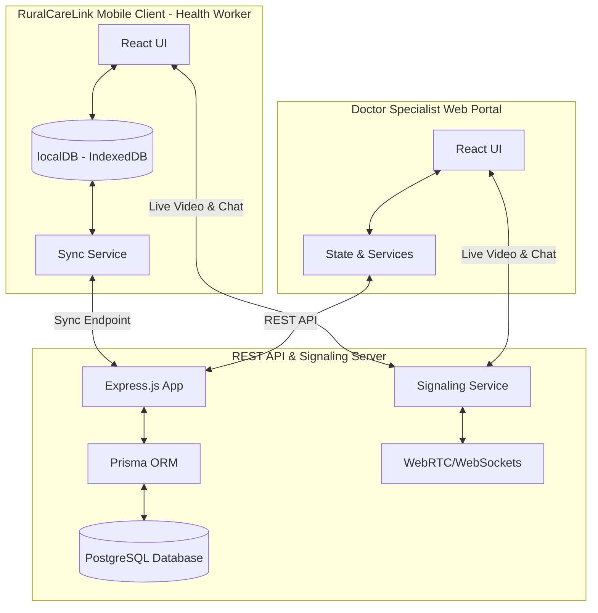

# RuralCareLink Platform Documentation

RuralCareLink is an offline-first, low-bandwidth optimized telemedicine platform designed to connect community health workers in remote Indian villages (Primary Health Centres - PHCs) with specialist doctors in urban hospitals.

---

##System Architecture

---

##RuralCareLink Mobile App (Health Worker Client)

Designed to run on low-cost tablets and smartphones, utilizing offline-first principles to operate in areas with intermittent or zero internet connectivity.

### Key Features
1. **Offline-First Patient Registration**:
   - Collects full demographics, contact numbers, and village details (e.g. Wagholi, Akrani).
   - Integrates optional Aadhaar / ABHA (Health ID) fields.
   - Saves records securely to Local IndexedDB when offline.
2. **Vitals & Clinical Data Logging**:
   - Captures Blood Pressure (BP), Pulse Rate, Temperature, SpO2, Respiratory Rate, and Weight.
   - Supports structured chief complaints and symptoms logging.
3. **Smart Synchronization**:
   - Auto-detects internet connection state.
   - Synchronizes cached offline visits and registration data to the central server when online.
4. **Bandwidth-Adaptive Consultation Room**:
   - Handles real-time video consultations.
   - **Network fallback**: Dynamically degrades video to chat-only mode under poor rural connection conditions.
5. **Advice & Alerts Screen**:
   - Displays real-time prescriptions, diagnosis notes, and medical advice sent by doctors once a case is reviewed.
6. **Multi-lingual Support (i18n)**:
   - Localization for **English**, **Hindi (हिंदी)**, **Marathi (ಮರಾठी)**, **Kannada (ಕನ್ನಡ)**, **Tamil (தமிழ்)**, and **Telugu (తెలుగు)**.

###Technology Stack & Dependencies
* **Core**: React `18.3.1`, TypeScript, Vite `6.3.5`
* **Mobile Wrapper**: Capacitor `^6.0.0`
* **Local Storage**: IndexedDB (using `idb`)
* **Styling**: Tailwind CSS
* **Icons**: Lucide React

---

##Doctor Dashboard (Specialist Web Portal)

A premium dashboard for doctors to review patient history, consult in real-time, issue prescriptions, and manage follow-ups/referrals.

### Key Features
1. **Case Queue & Queue Management**:
   - Lists pending cases synced from various PHCs.
   - Sorted by date/time (removes old risk priority tags for a cleaner medical queue).
2. **Patient History & Charts**:
   - Visualizes vital trends (e.g., BP and Temperature graphs) using interactive charts.
   - Keeps track of all historical visits, previous prescriptions, and clinical notes.
3. **Interactive Case Review Panel**:
   - Dual-column workspace: Doctor can submit diagnoses, prescriptions, and follow-up plans while actively conducting a call.
   - Allows upload/view of diagnostic file attachments (PDFs, images) uploaded by the PHC health worker.
4. **Follow-Up & Referral Management**:
   - Schedule follow-ups with calendar highlights.
   - Refer patients to higher tertiary hospitals with contact details and reason for referral.
5. **Doctor Profile Settings**:
   - Simplified settings page containing only the doctor's professional information.

###Technology Stack & Dependencies
* **Core**: React `18.3.1`, TypeScript, Vite `6.3.5`
* **Charts**: Recharts `2.15.2`
* **Styling**: Tailwind CSS `4.1.12` & Material UI (MUI) `7.3.5`
* **Icons**: Lucide React `0.487.0`

---

##Backend API & Signaling Server

A Node.js backend providing database operations, authentication, synchronization logic, and real-time signaling for WebRTC peer connections.

###Key Features
1. **REST APIs**:
   - `/auth/login` - Secure JWT-based credentials check.
   - `/visits` & `/patients` - Retrieve and manage cases.
   - `/sync` - Dual-way sync endpoint matching offline IDs to database records.
2. **WebRTC Signaling**:
   - Facilitates connection handshakes between Doctor Dashboard and Mobile Clients for live video/audio calls.
3. **Database Layer**:
   - PostgreSQL database accessed via Prisma Client ORM for type-safe queries.

###Technology Stack & Dependencies
* **Express Framework**: Express `^5.2.1`
* **Database ORM**: Prisma Client `^7.8.0` & `@prisma/adapter-pg`
* **Database Driver**: pg `^8.21.0`
* **Authentication**: jsonwebtoken `^9.0.3` & bcryptjs `^3.0.3`
* **Security & Logger**: Helmet `^8.2.0`, Cors `^2.8.6`, Morgan `^1.11.0`
* **File Uploads**: Multer `^2.1.1`
